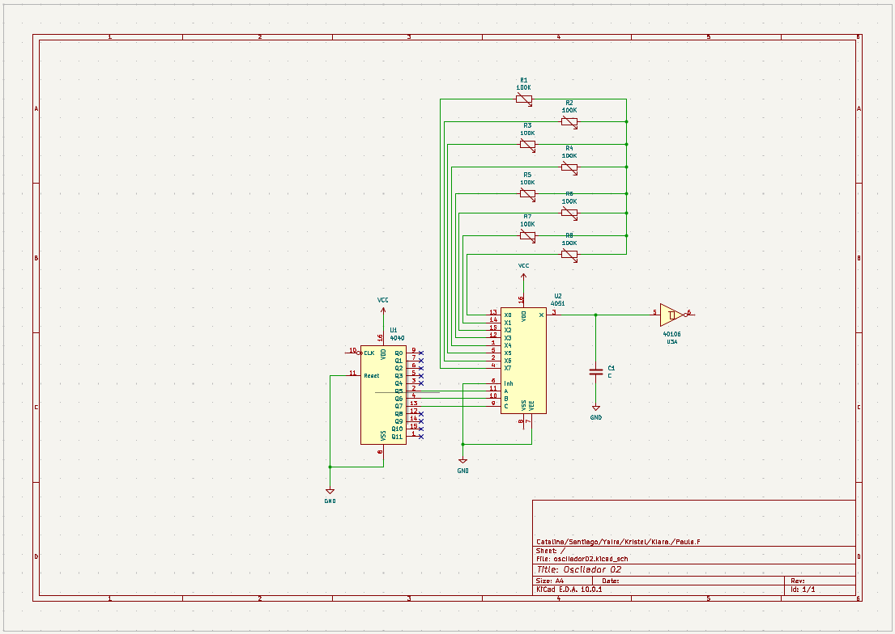

# proyecto-02

## Grupo

Número de grupo: 04

Tema del grupo: Oscilador 2

Integrantes:

- Kristel Andrea Ladrón de Guevara Jara / kristelagj
- Paula Andrea	Fuentes Mena / paulafuentesm
- Santiago Cifuentes Vélez / santiagocifuvelez
- Yaira Alexandra	Ruiz Ossandón / yairaruiz
- Catalina Anatonia Oyanedel Sanchez / catalinaoyanedel-01
- Antonella Kiara Aguilar Plate / antokiaraa

## Circuito 1

Título módulo 1

### Descripción general/conceptual 1

¿Qué hace el circuito? Intentar explicarlo para gente que no sabe electrónica. Ejemplo: escucha los impactos sobre sí mismo y lo convierte en señales de aviso para otras cosas

### Descripción de funcionamiento 1

Preguntas orientadoras: ¿Qué inputs recibe? ¿Qué outputs entrega? ¿Cómo administra los flujos de inputs a outputs internamente? ¿Qué componente es el "corazón/cerebro"? ¿Qué truco descubrimos en el camino? ¿Especulativamente, qué se podría conectar a este módulo en el futuro?

### Esquemático 1

```markdown

```

### PCB 1

```markdown

```

```markdown

```

### Documentación audiovisual funcionamiento protoboard 1

Incluir enlace a video en youtube (puede estar en Oculto) con protoboard funcionando

## Circuito 2

Título módulo 2

### Descripción general/conceptual 2

¿Qué hace el circuito? Intentar explicarlo para gente que no sabe electrónica. Ejemplo: escucha los impactos sobre sí mismo y lo convierte en señales de aviso para otras cosas

### Descripción de funcionamiento 2

Preguntas orientadoras: ¿Qué inputs recibe? ¿Qué outputs entrega? ¿Cómo administra los flujos de inputs a outputs internamente? ¿Qué componente es el "corazón/cerebro"? ¿Qué truco descubrimos en el camino? ¿Especulativamente, qué se podría conectar a este módulo en el futuro?

### Esquemático 2

```markdown

```

### PCB 2

```markdown

```

```markdown

```

### Documentación audiovisual funcionamiento protoboard 2

Incluir enlace a video en youtube (puede estar en Oculto) con protoboard funcionando

## Otros circuitos

¿Usaron otro circuito temporal para activar algunas cosas? ¿para probar inputs-outputs? Detallar cuales

Sí, para probar las salidas de las dos propuestas, se utilizó el circuito potenciador señalado en el proyecto 01, basado en el amplificador LM386. La señal generada por el oscilador es enviada al potenciador, permitiendo amplificarla y reproducirla mediante un parlante para verificar su funcionamiento.
En este caso, no fue necesario utilizar un circuito de una entrada inputs, ya que el chip CD40106 recibe en el pin 1 una señal generada por el propio circuito mediante una realimentación desde la salida, a través de una red de resistencias y condensadores. Este mecanismo permite que el circuito oscile de forma autónoma y produzca una señal de audio.
Mientras que la señal OUT, fue conectada a la entrada del circuito al potenciador mediante un potenciómetro de 100 kΩ conectado a la pin 1,  que permitía regular el nivel de señal ( volumen ). La salida del LM386 fue conectada a un parlante, permitiendo escuchar la señal generada y verificar el correcto funcionamiento del sistema. 
foto de el circuito output ( si es que se puede )

## Colaboración con otros grupos

No tuvimos.


### ¿Cómo ayudé a otro grupo?

El servicio y la ayuda de nuestro grupo, se vió reflejado en la solidaridad de ir a la locación de San Diego, en la parte central de la ciudad, para comprar los elementos que cada grupo requería (el grupo 01, 02, y 03) y así mismo iniciar los procesos de materialización de los circuitos. Además, junto al grupo 03 (osciladores 1), estuvimos en constante conversación para saber que tipos de chips estaban haciendo y cómo iban evolucionando con su trabajo. 

### ¿Cómo me ayudó otro grupo?

El grupo 03 (osciladores 01), nos ayudó prestandonos 2 potenciómetros que se nos habían dañado. También, Carla, integrante del grupo (de vania), nos enseñó en la sala de clases como importar una librería de huellas (que serían los estándares generales para la entrega de la solemne 02).

## Bibliografía

- ZAK Sound. (2021, 27 de septiembre). Qué es ADSR y cómo usarlo (explicado). ZAK Sound. https://zaksound.com/es/blog/what-is-adsr 

- Williams, E. (2015, 4 de febrero). Logic noise: Sweet, sweet oscillator sounds. Hackaday. https://hackaday.com/2015/02/04/logic-noise-sweet-sweet-oscillator-sounds/ 

- Williams, E. (2015, 23 de febrero). Logic noise: The switching sequencer has the beat. Hackaday. https://hackaday.com/2015/02/23/logic-noise-the-switching-sequencer/ 

Schauer, K. (2021, 18 de noviembre). Demostración del retransmisor de comunicaciones láser de la NASA: Seis cosas que necesitas saber. NASA. https://www.nasa.gov/feature/goddard/2021/demostraci-n-del-retransmisor-de-comunicaciones-l-ser-de-la-nasa-seis-cosas-que-necesitas/ 


