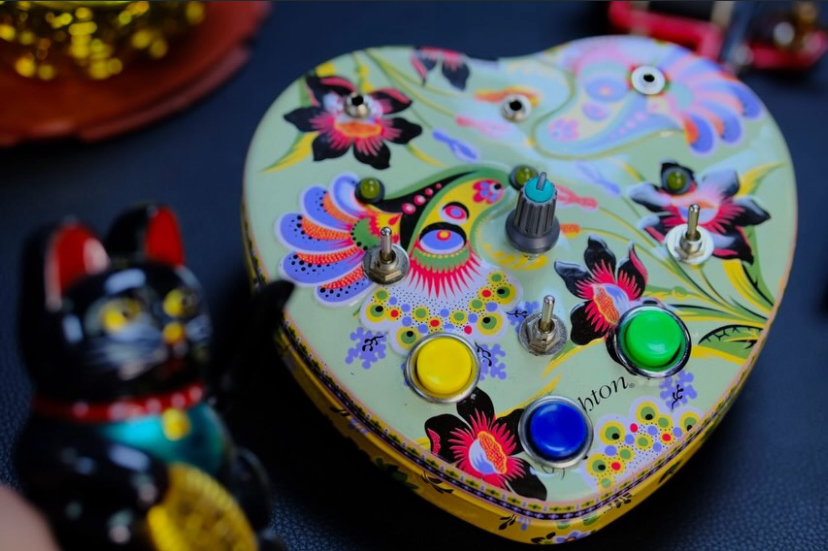

# sesion-13a
### Martes 9 de junio del 2026

**Clase**

La primera clase después de la presentación del proyecto 2.

Les profesores nos instruyeron sobre las partituras y el proceso sobre las placas, tanto como costos, envío y condiciones. 

### Exportación de Archivos Gerber para Fabricación de PCB

Para hacer una PCB se tiene que exportar el diseño en formato Gerber desde KiCad. 

Deben tener las siguientes capas:

+ 2 capas de cobre por las dos caras
+ 2 capas de silkscreen
+ 2 capas de máscara de soldadura
+ 1 capa de contorno

Desde KiCad te metes a Plot, seleccionas las capas a utilizar y se generan los archivos gerber con a los archivos de taladrado. Antes de manadar a fabricar la placa se tiene que revisar los resultados en el visor de gerber, corroborando que sean las capas correctas y que la silkscreen no cubra los nombres de los componentes.

Después de checkear todos los archivos se comprimen en un archivo tipo zip
y se suben a JLCPCB. La plataforma hace una revisión y te permite revisar la PCB a través de gerber view con todos los detalles.

Por último se añaden los detalles como la cantidad de placas, el color y el acabado.

### Carcasa

Algunas imagenes de inspiración para la carcasa.

Corazón de robota: Artista Chilena que nos enseñó Aarón al inicio del semestre.

[Página web corazón de robota](https://corazonderobota.art/)

## Encargo cap 1 y 2

### Cap 1 Música

1.- PIEZA DE VOZ PARA SOPRANO: Gritar
1. contra el viento
2. contra la pared
3. contra el cielo

Desafiar las adversidades y hacerte ver no importa lo que sea. Aprovecha tu don natural, que en este caso se refiere a tu voz, resonante y potente.

2.- Pieza en edificio para orquesta: Ir de una habitación a otra abriendo y cerrando cada puerta.
No hacer ningún ruido.
Ir de lo alto del edificio hasta abajo.

Quizá explorar cada parte de algo o un lugar aunque no seas reconocido por hacerlo. Mantenerlo como una recompensa personal.

3.- Pieza de peces: Grabar las voces de los peces en una noche de luna llena.
Grabar hasta el amanecer.

Este lo quise incluir porque me encantan los peces y todo lo relacionado a lo acuático. Cuando era chica me fascinaban las sirenas.
Pero de un punto de vista de reflexión lo tomo como que los peces por más que no tengan una "voz" pueden generar sonido, llegando a ser parte de su identidad. Sonidos que únicamente los peces pueden hacer. A parte sé que la luna está relacionada con el agua, el hecho de que sea una luna llena debe de haber algún tipo de influencia en esta y quizá en los peces, aunque desconozco del tema desde un punto científico. Lo que sé sobre este tema viene de avatar: la leyenda de aang donde van a la tribu del norte y que mencionan que los poderes de los water benders se hacen más poderosos en luna llena, llegando a lograr hacer sangre control. En el capitulo donde atrapan un espíritu de la luna los cuales con peces koi representando el ying y el yang me hace recordar mucho a esta página del libro. También quiero hacer una honorable mención a h2o sirenas del mar que también son influenciadas por la luna llena.

### Cap 2 

1.- Pintura para el viento: Hacer un agujero en una bolsa llena de semillas de cualquier clase y poner la bolsa al viento.

Tener un algo, ya sea tangente o no. Y permitir que los caminos del destino o naturaleza los guíe.

2.- PINTURA HASTA QUE SE CONVIERTA EN MARMOL:
Recortar y colgar un cuadro, diseño, foto o escrito (impreso o no) que a uno le guste.
Hacer que las visitas recorten sus partes favoritas y se las lleven.
Por ejemplo, si a la visita le gusta el rojo, hacer que se lleve todas las partes rojas.
Pedir a muchas visitas que corten su parte favorita hasta que no quede nada de toda la cosa.
En caso de un escrito, pedir a la visita que recorte su letra o palabra favorita.

Siento que esto alude al propósito de una obra y como quiere ser exhibida a su público. En el caso de que si qiuiera ser compartida con el público, debería SER compartida, como algo simbólico o literal.
