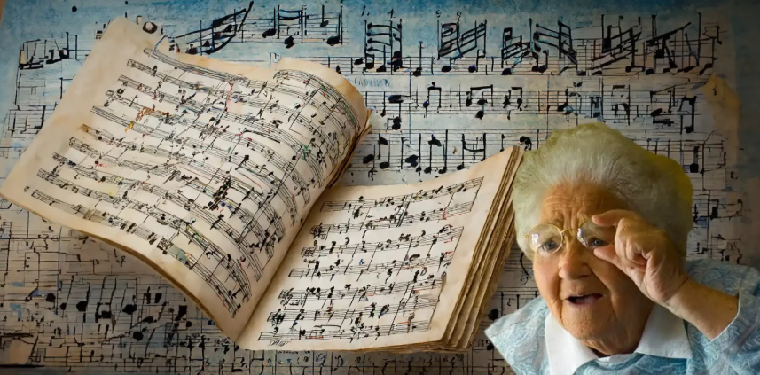
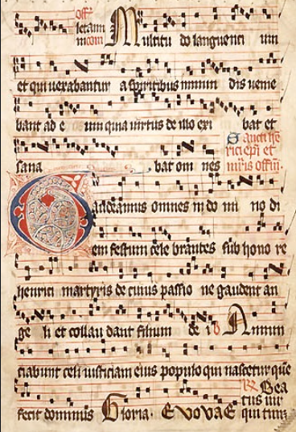
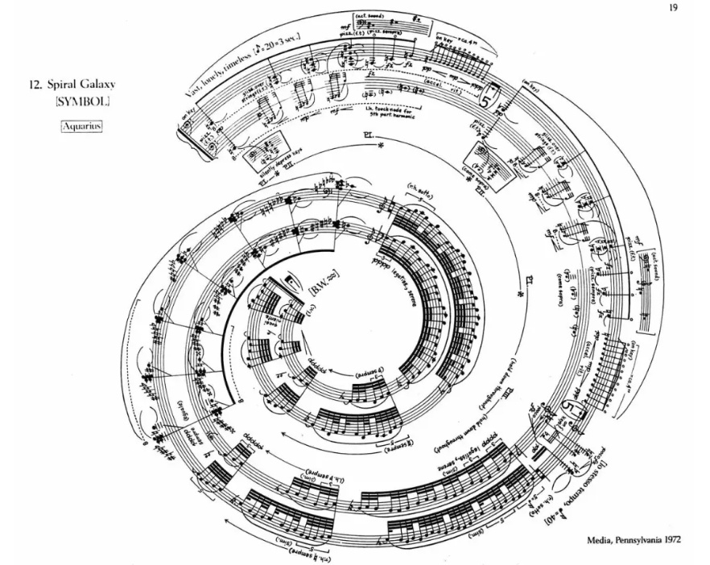
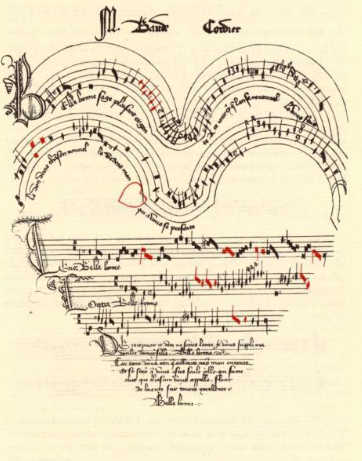
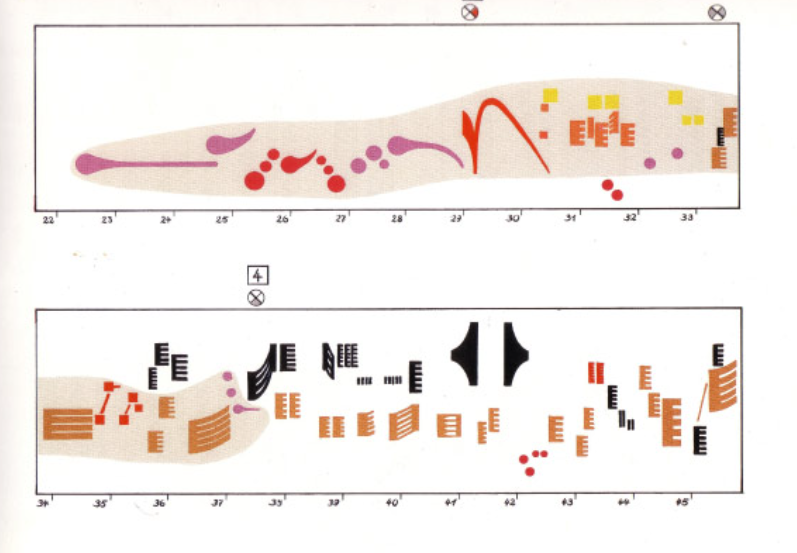

# sesion-13b

12-06-2026

## Partituras

En clases aprendimos qué es una partitura y cómo interpretarla. Entendimos que una partitura puede leerse y comprenderse de distintas maneras, no solo desde la notación musical tradicional que conocemos actualmente, como la clave de sol y otros signos convencionales. También puede funcionar como un sistema gráfico de instrucciones, capaz de representar sonidos, ritmos o formas de interpretación a través de distintos recursos visuales.

## Referente de partituras

## Trabajo en grupo

Primero definimos las placas que utilizaremos para desarrollar nuestro sintetizador, asignando a cada una un rol sonoro específico dentro del sistema:

- **Barry Benson (abeja)** → percutor  
- **Lub-dub (corazón)** → percutor  
- **Chirihue mecanizado (pájaro)** → oscilador  

La propuesta busca construir una especie de **ecosistema sonoro**, donde convivan y dialoguen los sonidos de la abeja, el pájaro y el corazón. Por esta razón, el sistema está pensado para que los tres sonidos funcionen de manera **independiente, pero simultánea**, generando una superposición de capas sonoras.

Para unir todos los elementos, se considera un sistema de conexión que integre tanto las partes internas del circuito como aquellos componentes que se manipularán externamente una vez construida la carcasa. En este contexto, el **silencio** también se vuelve un elemento importante dentro de la propuesta, ya que permite controlar la presencia, ausencia o predominancia de ciertos sonidos dentro del ecosistema.

## Ideas generales de partitura

### Primera propuesta

La primera idea de partitura consiste en un sistema de instrucciones que dependa de la interacción del usuario con el dispositivo. Se proyecta como una partitura de **24 horas**, donde el comportamiento del sintetizador cambie según el momento del día. A través de esta lógica, el usuario modificaría los potenciómetros para destacar más al pájaro, la abeja o el corazón, generando distintas atmósferas sonoras a lo largo del tiempo.

Por ejemplo:

- **08:00 a 12:00**
  - El pájaro canta rápido, pero con volumen bajo.
  - La abeja se mueve rápido, pero suena suave.
  - El corazón mantiene un pulso acelerado.

De esta manera, la partitura no solo organiza sonidos, sino que también propone una relación temporal y dinámica entre los distintos elementos del ecosistema.

### Segunda propuesta

La segunda idea se enfoca en desarrollar un **lenguaje gráfico propio** para cada uno de los sonidos del sintetizador.

- **Corazón:** podría representarse mediante **puntos**, entendidos como golpes o latidos repetitivos.  
- **Abeja:** podría diagramarse como un **camino curvado con línea discontinua**, sugiriendo su recorrido vibrante e inestable.  
- **Pájaro:** aún no está completamente definido, pero se proyecta que también tenga un lenguaje visual propio que exprese su comportamiento sonoro.  

La intención es que cada elemento cuente con una representación gráfica diferenciada, y que además tenga un **color propio** para facilitar su identificación cuando las tres capas sonoras se encuentren superpuestas. Esto permitiría leer la partitura de forma más intuitiva, entendiendo que cada sonido actúa de manera independiente, pero al mismo tiempo convive con los otros dentro de una misma composición.
