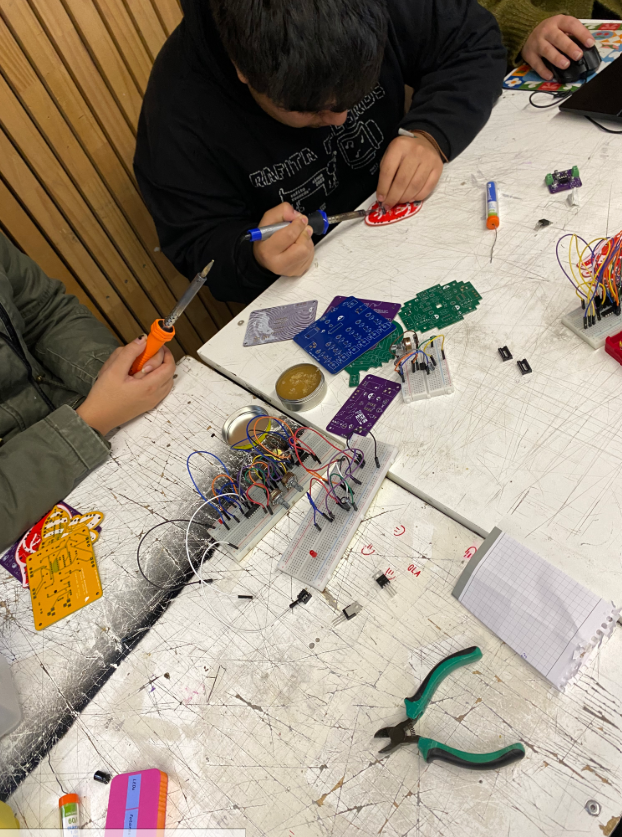
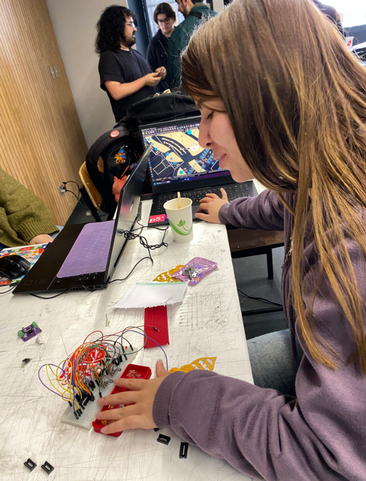
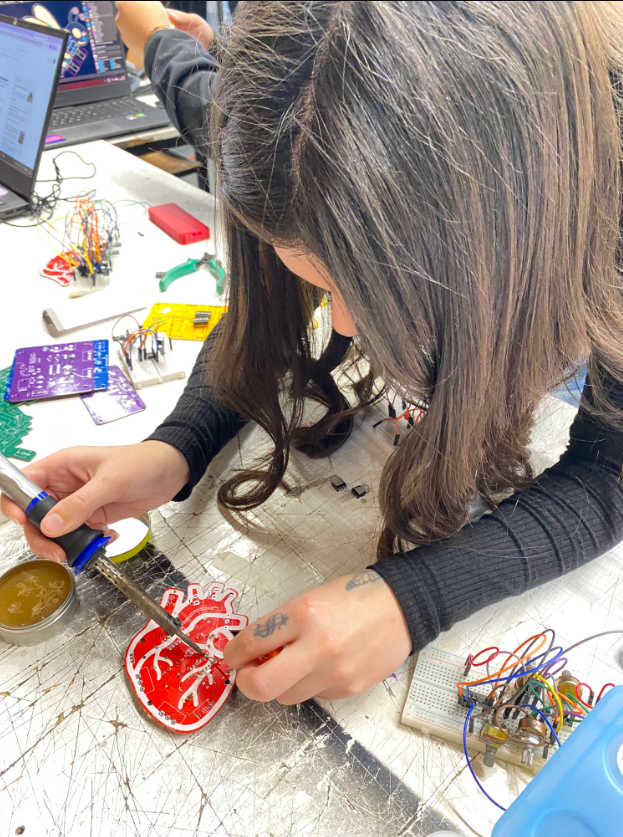
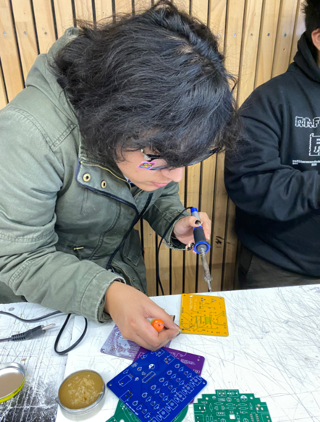
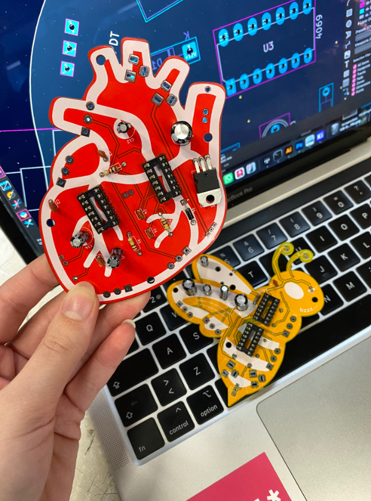
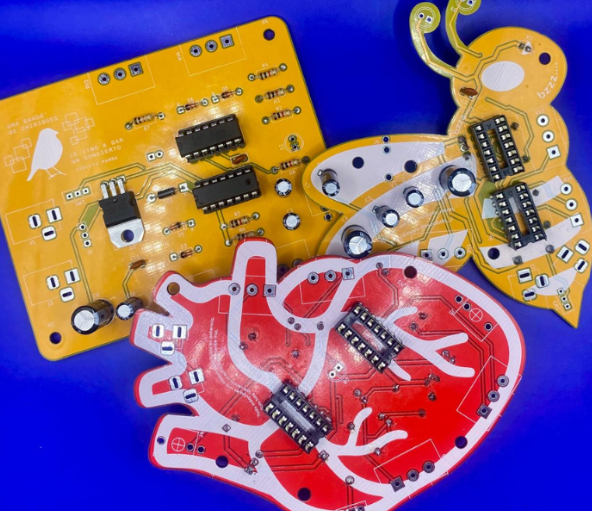

# sesion-14a

16-06-2026

## ¿Qué sucedió en clases?

Ayer llegaron las placas, así que comenzamos el proceso de soldadura de las tres que definimos para nuestro sintetizador: **Barry Benson**, **Lub-dub (corazón)** y **Chirihue mecanizado**.

Como Martina y Carla no sabían soldar, Vania y yo les enseñamos el proceso y las acompañamos mientras armábamos las placas. Al mismo tiempo, Cata avanzó en la elaboración del **BOM** del proyecto.

## Fotos de proceso

### Problemas

Durante el armado de la placa de la abeja tuvimos algunos errores que debimos corregir. En un principio instalamos un capacitor de **10 uF**, pero correspondía uno de **100 uF**. Además, pensábamos que los diodos no tenían polaridad, por lo que inicialmente los ubicamos en una posición incorrecta.

También evaluamos cambiar la posición de los chips al reverso de la placa por una decisión más estética, pero al revisar el circuito nos dimos cuenta de que eso alteraba el orden de los pines, por lo que finalmente decidimos montarlos en la orientación correcta.

Todos estos errores fueron corregidos desoldando los componentes con la **gota aspiradora**, lo que nos permitió reemplazarlos y continuar con el armado de manera adecuada.
