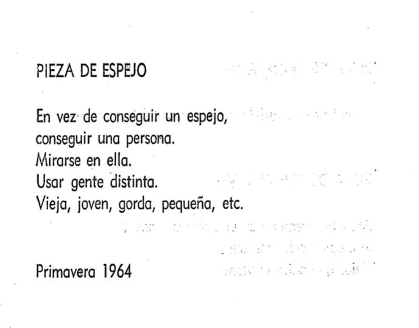

# sesion-13b

falte a la clase por motivos de salud pero lei los caps del libro:(

## POMELO 3, 4

en estos dos caps la pieza que más me llamó la atención fue Pieza de Espejo. la instrucción es simple: en vez de conseguir un espejo, conseguir una persona, mirarse en ella, usar gente distinta, vieja, joven.
lo primero que pensé fue en la percepción. la que tienen los demás sobre mí, y la que tengo yo sobre ellos. porque en el fondo nunca sabemos realmente cómo nos ven, solo tenemos nuestra propia interpretación de eso, que tampoco es del todo precisa. hay algo ahí que no se puede cruzar del todo, una distancia entre lo que uno es y lo que el otro ve, y entre lo que el otro es y lo que uno cree ver.
lo veo desde la aceptación, cada persona que me mira está viendo algo distinto, y eso no está mal, es simplemente así. como si uno fuera muchas cosas al mismo tiempo dependiendo de desde dónde te miren, y ninguna versión fuera completamente falsa ni completamente verdadera.
se plantea de una forma muy cotidiana, casi como un experimento simple. pero debajo de esa simpleza hay algo bastante profundo: los espejos nos muestran una imagen fija, pero las personas nos devuelven algo vivo, mirarse en alguien no es solo verte a ti, es verte a ti pasado por todo lo que esa persona carga.

**pequeña reflexión** 

este año aprendí a soltar un poco la necesidad de controlar cómo me perciben. que cada uno va a ver lo que puede ver, y que eso dice tanto de ellos como de mí.
