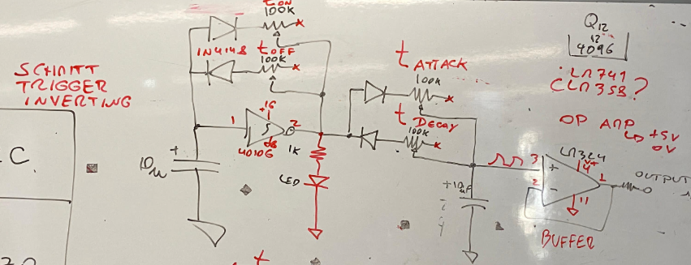

# sesion-10b

## trabajo en clases

Con nuestro grupo empezamos a investigar que chips utilizar para nuestro oscilador 2. Nuestras opciones son el 4106, el 4046 cmos (genera onda cuadrada), el 4093 (que también genera onda cuadrada) y el LM324 (el cual puede generar ondas cuadradas y triangulares)

La onda  sinusoidal o senoidal es la más compleja de hacer.

"Al armar circuitos a mano en una protoboard, la onda sinusoidal es la más difícil de generar porque requiere componentes con valores matemáticamente perfectos y los circuitos analógicos tienden a distorsionar la curva de forma natural. En electrónica analógica, es mucho más fácil generar ondas con esquinas (como la cuadrada o la de diente de sierra) porque solo requieren que un chip cambie entre "encendido" y "apagado". Una sinusoide exige una variación de voltaje infinitamente suave, lo cual choca con las limitaciones del hardware casero."

_(Vista de IA - Fuente: https://www.electronicayciencia.com/2010/04/multivibrador-astable-transistores.html)_

Finalmente, Misa nos ayudó a llegar a un esquématico con los chips 40106 (que tuvimos que comprar) y LM324 (que teníamos). 

-----------------------------------------------------------------------------------

## análisis libro: capítulos 6 y 7

### capítulo 6: la distribuición de la fotografía.

Este ha sido el capítulo que más me ha costado entender. A pesar de eso, quiero destacar los puntos que encontré más interesantes:

- La **_entropía_** se ha expandido a distintas disciplinas para explicar la tendencia de los sistemas hacia la degradación o la incertidumbre y el hombre se opone a esta ley natural al almacenar y transmitir información.
- La información se puede definir como espíritu y que produce cultura, objetos con formas improbables.
  
    - Me da curiosidad pensar en cómo en estos tiempos y a través del avance de las civilizaciones, cada vez nos acercamos a lo inmaterial. El desarrollo del humano ha partido desde las necesidades más básicas como la caza, sobrevivir, la reproducción por necesidad, hasta llegar a nuestra mente actual que busca ir más allá de sólo sobrevivir, sino en encontrar un propósito.
    - Se han ido incorporando conceptos como el "mundo de las ideas", que muchas veces nos han mencionado en clases, también está la idea de "conceptos culturales" de Flusser. Estamos sobreestimulados de información, de ideas, conceptos y tendencias. Pareciera que cada vez más, con la rapidez de la información, vivimos más consciente de nuestra mente que no descansa que de nuestro cuerpo y así cada vez más habitamos este mundo e formas improbables.

- "En otras palabras, el poder no está en manos del propietario de la fotografía, sino en las del programador de información; es un poder neoimperialista."
- "En teoría, toda información puede situarse en cualquiera de estas tres categorías: información indicativa, como "A es A"; información imperativa, como "A debe ser A", e información optativa, como "deja que A sea A".

### capítulo 7: la recepción de la fotografía ✶✶✶

Este fue mi capítulo favorito porque me recordó de muchas cosas que me gusta leer.

- "Sin embargo, quien sabe tomar fotografías no necesariamente sabe cómo descifrarlas."
- "Estas instrucciones se vuelven cada vez más simples conforme se aplica la tecnología de los aparatos. De nuevo, esta es la esencia de la democracia de la edad posindustrial."
  
  - Además la automatización y simplicación de los aparatos, hoy en día hasta la misma información sufre lo mismo. La simplificación de las ideas y de los formatos (como reels / tiktoks), si bien han logrado de cierta forma _democratizar_ la información, también nos han hecho pensar cada vez menos, volviendo a la misma idea de vivir en base a las imágenes.
  - _"Nadie cree que sea necesario descifrar las fotografías, pues todo el mundo cree que sabe cómo producirlas."_
 
#### Esta fue mi idea favorita! ⁑

- "Los **vestigios de materialidad** que se adhieren a las fotografías dan la impresión de que podemos actuar históricamente con ellas." / "El recortar la fotografía del periódico, enviarla o destrozarla, es reaccionar a su mensaje **por medio de un acto ritual.**"
  
  - Me recuerda mucho a un libro que me prestaron una vez: Psicomagia de Alejandro Jodorowsky, se trataba de un tipo de psicología (muy) alternativa, donde ciertos problemas se trataban a través de actos mágicos y poéticos, entendiendo que la mente funciona en base de símbolos.
  - Según Wikipedia, su premisa central es que el inconsciente acepta el símbolo y la metáfora como si fueran hechos reales. Al no distinguir entre realidad física y ficción simulada, una acción puramente metafórica puede desbloquear un conflicto emocional arraigado de la misma forma que lo haría un evento real.
    
  - **_Ejemplos:_**
  - _Para superar el dolor por la muerte de un ser querido, el consultante debe plantar un rosal sobre una prenda íntima del fallecido y regarla diariamente con agua mezclada con sus propias lágrimas; al florecer la planta, el inconsciente procesa que la muerte física se ha transformado en nueva vida, permitiendo soltar el apego doloroso._
  - _Un artista paralizado ante el lienzo en blanco fue obligado a pintar su próximo cuadro utilizando únicamente sus dedos y lodo del jardín en lugar de pinceles y óleos; al ensuciarse deliberadamente y romper la rigidez de la perfección, su mente profunda eliminó el miedo a la crítica y desbloqueó su capacidad de crear._
    
  - Entonces, no es una idea descabellada el pensar que se pueda actuar históricamente sobre la materialidad de una imagen, ya que la mente funciona en base a símbolos y lo que ve lo entiende como verdad. Como un ejemplo muy común, de cortar a alguien que ya no está de una foto. Se actúa históricamente sobre la imagen, a través de un acto mágico, ya que se está interrumpiendo su linealidad histórica y simbólicamente está eliminando ese momento que algún día existió, pero tras ese acto ya no.
 

