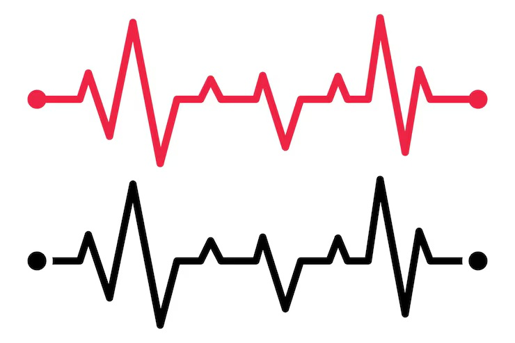
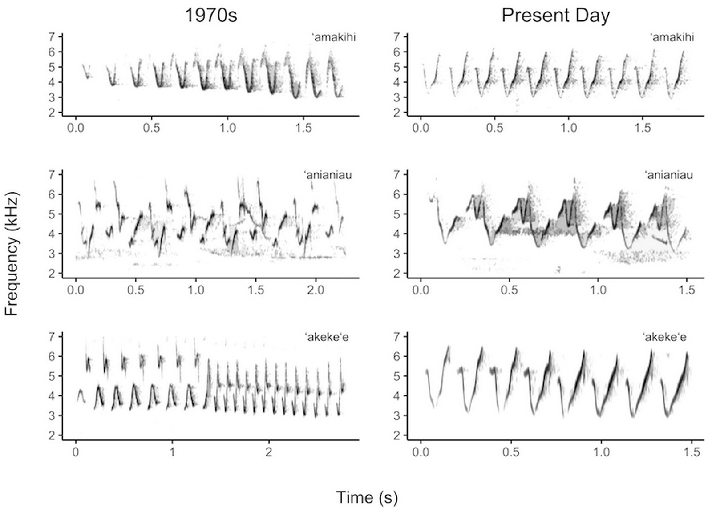

# sesion-14a

---

QUEDA TAN POCO!

Ok, entonces esta clase es mucho más de cosas manuales, por lo que es complicado tener anotaciones más contundentes...

Pero aquí hay fotos y más fotos!

- 

-

-

-

Por mi lado me tocó crear la segunda partitura del sintetizador.

Para ello dividí las 3 partes en códigos de colores:

🟡 Color representativo de las abejas.

🔴 Color de los corazones.

🟠 Color de los pájaros Chirihue (también para no repetir el amarillo de las abejas).

Cada una de las líneas en la partitura representan ciertas cosas:

## Las notas:

- Para las abejas, se hicieron las líneas que se usan para ilustrarlas de manera caricaturesca.

- El corazón es representado con los signos vitales que se pueden ver en una máquina... de signos vitales.

- Para el pájaro se hizo una variación de un espectrograma que captaba el sonido de las aves.

*Los espectrogramas son un gráfico visual que muestran los sonidos o señales acústicas registradas.*

Por el lado izquierdo de la partitura, se dividió en 5 partes iguales para medir el volumen, siendo la línea del centro el valor medio del volumen en general, considerando el valor mínimo (0) y el máximo (100).

En medio de la partitura, esta igualmente se parte en 5, pero en este caso, cada separación representa un minuto de la partitura.

## Resultado final

---

Yoko Ono

## Pomelo 5 y 6

### 5:

PIEZA TELESCÓPICA

Hacer una escultura para poner en una montaña

y que la gente la mire con telescopios.

- ¿y si fuesemos nosotres? pequeños siendo mirados desde telescopios

PIEZA DE TIENDA DE REPUESTOS

Abrir una tienda de repuestos donde se

vendan repuestos corporales: 

Cola

Pelo

Protuberancia

Joroba

Cuerno

Halo

Tercer Ojo

etc

- Creo que lo que quiere decir todo este cap (Que es mucho más corto que los otros) son que objetos tienen más valor en nuestras vidas, o el valor en general

Partes de nuestro cuerpo también son tratados como objetos, cosas que pueden ser vendidas o exhibidas. dandoles otro tipo de valor.

### 6:

SERIES DE FILMS IMAGINARIOS
SHI (De la cuna a la tumba del Sr. So)
Film lento rodado en el espacio de tiempo de 60 años,
siguiendo a una persona que nace y muere. Alrededor
del 30° año, el film se convierte en el de una pareja,
ya que el hombre se casa. En realidad, se va convirtiendo en "un film de espera" hacia el final, ya que
cbviamente empieza a adquirir una cualidad senil en el
trabajo de cámara, aunque el hombre del film todavía
aparece robusto. Es sorprendente que la muerte llegue
tan repentinamente, en forma de diarrea.
Film altamente increíble que hace pensar. Nunca se
sabe cuando va a morirse uno.

- Parecen ser más anotaciones y entrevistas que "partituras Yoko Onotasticas"
- Se habla bastante de la muerte pero como algo totalmente efimero y rapido. no hay tiempo para procesarlo y al siguiente verso "la muerte"

GUIÓN CINEMATOGRÁFICO 3

Pedir al público que corte la parte de imagen
de la pantalla que no le guste.

Proveer tijeras.

-Y por el otro lado, tenemos los gustos y las acciones de los espectadores en el cine
Si yo pudiera cortar partes de la pantalla

En la pelicula de Amazing Digital Circus, cortaria todo. 

No porque no me gustara, al menos la gran mayoria si me agrada, pero otras cosas no...

