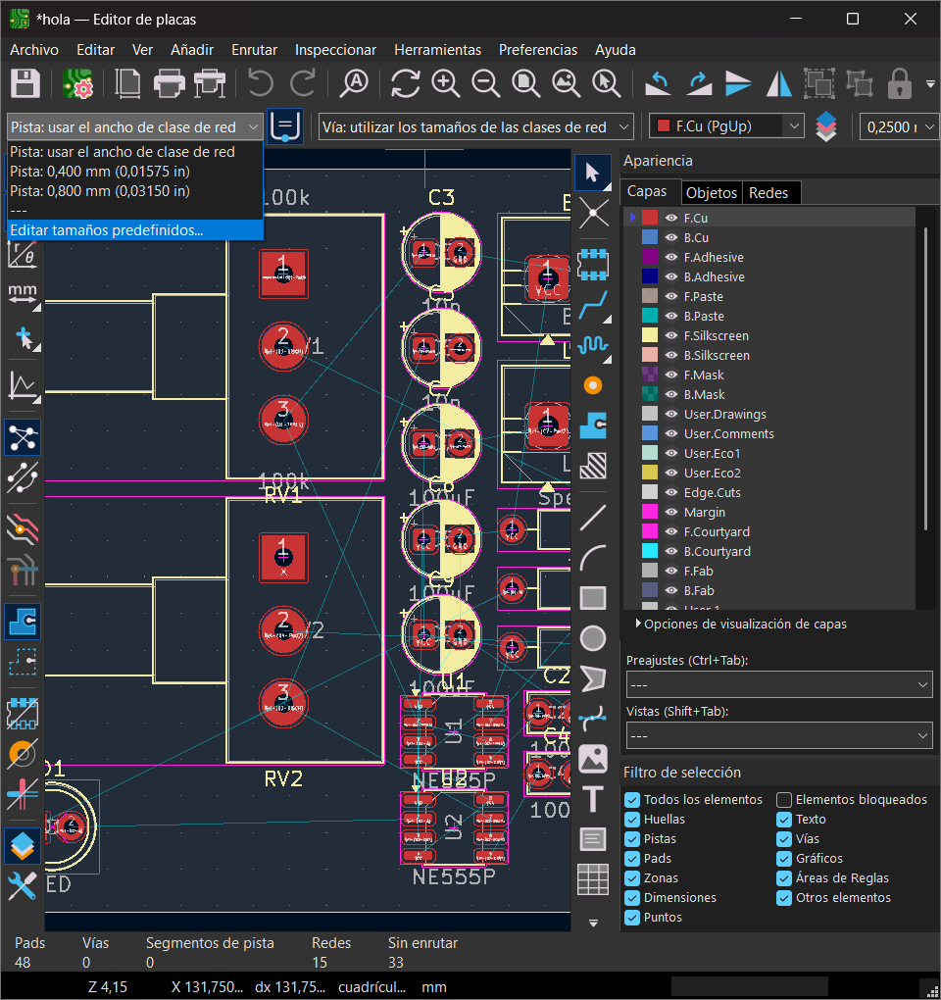
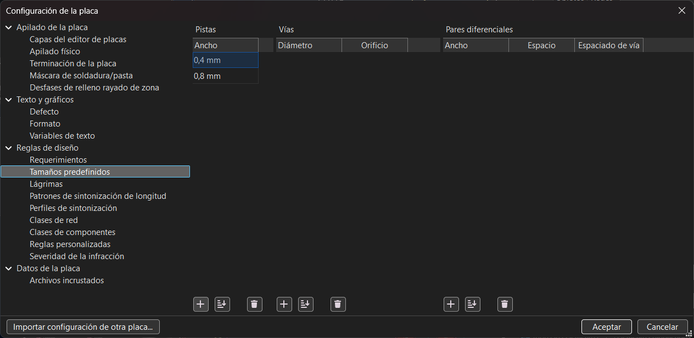
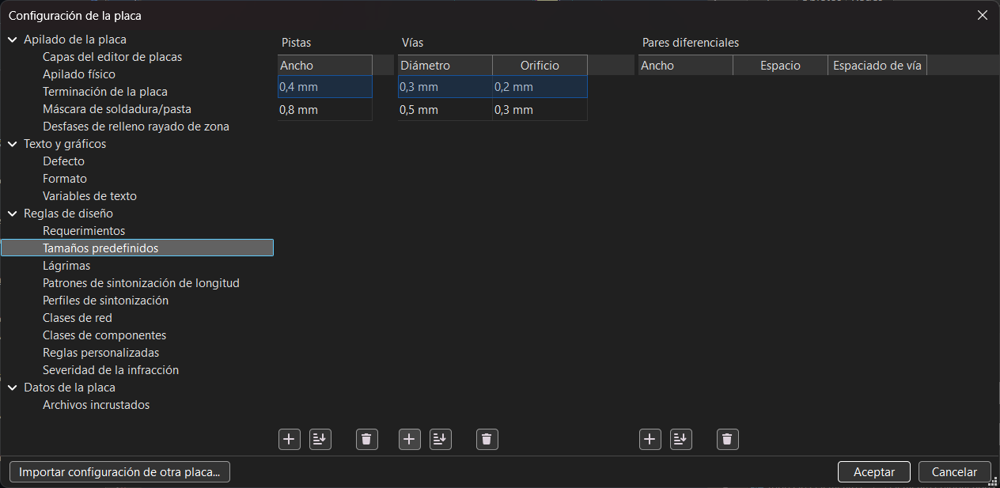
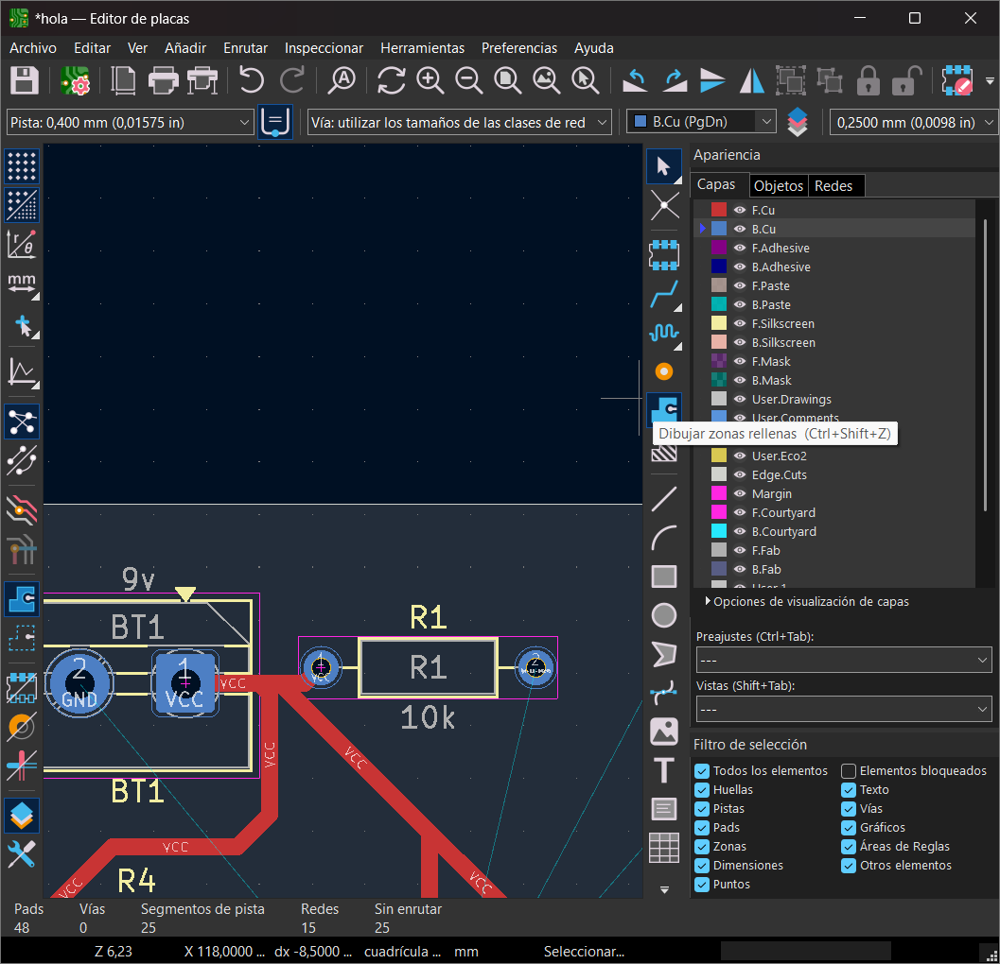
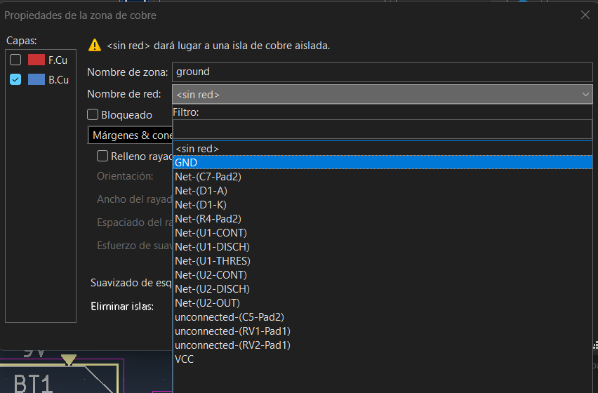

# sesion-09a

# Apuntes clase 12/05

Esta clase tuvo que ser mediante zoom debido a un incendio en república, lo cual hace un poco más difícil el trabajo ya que estamos usando el computador para trabajar y para ver la clase al mismo tiempo, lo cual es un poco confuso y nos puede distraer.

### Repaso rápido de KiCad

Para iniciar la materia nos hicieron un repaso rápido de cómo se utiliza KiCad, lo cual agradezco bastante ya que se me habían olvidado las siguientes cosas:

+ Para modificar el tamaño de la lámina en la cual estamos trabajando tenemos que hacer doble click dentro de la viñeta que se encuentra en la esquina abajo a la derecha.
+ Con click derecho se puede eliminar la asignación de una huella dentro del panel de asignación de huellas.
+ Para asignar huellas de manera más directa, selecciona el símbolo y presiona la tecla ``F`` de _footprint_ (huella).
+ ``Alt + 3`` para entrar al visor 3D.

### Capas de cobre

``F.Cu`` y ``B.Cu`` son las capas en donde se encuentran las pistas de cobre (las cuales son el equivalente a los cables dentro de nuestra protoboard) en donde una trabaja por el lado frontal (``F.Cu``) y la otra trabaja por el lado de atrás (``B.Cu``). Podemos tener distintos anchos en las pistas, los cuales tienen que ser mínimo de 0.3 mm.

Para poder añadir y editar grosores tenemos que hacerlo en la esquina superior izquierda donde se menciona la "Pista", luego de hacer click nos aparecerá la opción de ``Editar tamaños predefinidos...`` que es en donde podremos añadir y editar grosores para las pistas.

Cuando hagamos click en la opción que se muestra en la imagen anterior, nos aparecerá que estamos en la sección de ``Reglas de diseño -> Tamaños predefinidos``. Ya estando en este lugar, tenemos que presionar el símbolo ``+`` que se encuentra en la sección inferior de ``Pistas`` como se muestra en la siguiente imagen:

Cuando presionamos el símbolo ``+`` ya podremos agregar los tamaños que queremos, que en nuestro caso fue de 0.4mm y 0.8mm.

Como ya tenemos los grosores deseados, podemos empezar a crear las pistas ubicándonos en la capa correspondiente (``F.Cu`` o ``B.Cu``) y seleccionando la herramienta de ``Enrutar Pista Única`` o apretando la tecla ``X``.

Luego de aprender ésto, empezamos a hacer las conexiones positivas ya que Misa dijo que es mejor dejar el GND para el final con una herramienta que lo hace más rápido, por lo que seleccionamos la herramienta de ``Enrutar Pista Única`` y empezamos a conectar las cosas a VCC. Para evitar que se toquen las pistas, puedes ir turnando entre el lado frontal y el lado trasero, pero en el caso de que aún así no puedas hacerlo sin pasar a llevar otra pista, puedes usar la opción de ``Vías``, las cuales se hacen con la misma opción de enrutar pistas pero cuando quieras cambiar del lado frontal al trasero (o al revés), tienes que presionar la tecla ``V`` y se hará un orificio por donde viajará la pista de una cara de la PCB a la otra. Para poder editar el tamaño de la vía, tenemos que hacer el mismo proceso que se hizo con las pistas solo que ésta vez presionaremos el símbolo ``+`` que está en la columna de ``Vías``.

Cuando ya tengamos todos los positivos conectados entre sí, Misa nos indicó que utilicemos la herramienta de ``Dibujar Zonas Rellenas`` que nos aparece al costado derecho o simplemente podemos hacer ``Ctrl + Shift + Z``. 

Una vez la seleccionemos, haremos click en nuestra tabla de trabajo y nos aparecerán las propiedades de la zona, en donde tenemos que ponerle un nombre a ésta y luego asignarle el "Nombre de red", en el cual tenemos que seleccionar la opción de ``GND``. Luego de delimitar el espacio (el cual no importa que sea más grande que la PCB con tal de que la abarque por completo) tenemos que presionar la tecla ``B``, lo cual hará que se rellenen todos los espacios en GND.

Para poder montar nuestra PCB a nuestra carcasa, tenemos que hacerle hoyos para poder poner separadores o pernos (los pernos son la opción más barata), por lo que Misa nos recomienda su tamaño predeterminado que es para el perno M3. Para poder añadir los espacios para los pernos, hay que buscar en símbolos la opción de ``Mounting Hole`` y pondremos cuatro en nuestro esquemático. Luego de tenerlo en el esquemático, le añadimos la huella ``mounting hole 3.2mm`` que corresponde al M3 para luego pasarlo al editor de placas y poder ubicarlos en donde nos guste.

> DATO: para poder importar vectores, hay que descargar un archivo .dxf o podemos hacer nuestro propio vector, ir a archivo, seleccionar la opción de importar gráficos, buscamos nuestra imagen y podremos modificar su escala si es necesario.

---

# Encargos

### KiCad

Como encargo se nos indicó practicar lo que aprendimos en la clase, lo cual fue hacer esquemáticos y PCB. Para practicar, tenemos que elegir dos de las cuatro partes que componen nuestro sintetizador (el que realizamos para el gran proyecto 01) y replicarlo en KiCad, tanto el esquemático con nuestras modificaciones como la PCB de éste.

Para éste encargo decidí hacer la sección del reloj (chip 555) y del amplificador (lm386), en el cual solo hicimos unos cambios en la sección del 555. Al momento de hacer el esquemático del 555 no tuve mucho problema fuera del hecho de que me molestó el orden de los pins, ya que el pin 5 se encuentra en la parte superior siendo que va directo a GND, lo cual intenté cambiar buscando información en google (terminé en este link: <https://www.build-electronic-circuits.com/how-to-edit-symbol-in-kicad/>) en donde me indicaron que tenía que hacer una copia del símbolo para poder editarlo dentro de una biblioteca nueva, pero al momento de hacer eso solo me permitía editar el ``NE555D`` y no el ``NE555P``, lo cual se me hizo raro y preferí dejarlo como viene por default ya que solo es tirar un cable para al lado, no sé por qué me molestó tanto en su momento la verdad.

Cuando terminé de mover los componentes y unirlos, llegó el momento de asignar huellas y utilicé las que nos habían mencionado la clase antes pasada, los cuales son los siguientes:

+ Capacitores cerámicos: ``Capacitor_THT:C_Disc_D3.8mm_W2.6mm_P2.50mm``
+ Resistencias: ``Resistor_THT:R_Axial_DIN0207_L6.3mm_D2.5mm_P10.16mm_Horizontal``
+ Capacitores con polaridad: ``Capacitor_THT:CP_Radial_D5.0mm_P2.50mm``
+ LEDs: ``LED_THT:LED_D5.0mm``
+ Potenciómetro: ``Potentiometer_THT:Potentiometer_Alps_RK163_Single_Horizontal``
+ Parlante: ``TerminalBlock:TerminalBlock_MaiXu_MX126-5.0-02P_1x02_P5.00mm``
+ Chip de 8 pins (555 y lm386): ``Package_DIP:DIP-8_W7.62mm``
+ Batería 9V: ``TerminalBlock:TerminalBlock_MaiXu_MX126-5.0-02P_1x02_P5.00mm``
+ Separadores: ``MountingHole:MountingHole_3.2mm_M3``

Una vez ya agregadas las huellas, di el esquemático por terminado y quedó así:

Como ya todos los símbolos tenían sus huellas asignadas, pasé todos los elementos al modo placa para poder empezar a editar mi PCB en la cual como tamaño elegí hacer un rectángulo de 90 x 55 mm (tamaño de tarjeta de presentación) y dejé las puntas redondeadas con un radio de 7mm. Como ya tenía el límite definido, empecé a ordenar los componentes para luego formar las pistas de cobre de todos los positivos para dejar los negativos al final. Cuando terminé de hacer las pistas, me di cuenta que no había cambiado el tamaño del ancho por lo que borré todo (que no es mucho la verdad, sonó súper dramático) y lo hice con los tamaños que utilizamos durante la clase (0.4mm y 0.8mm), lo que me dejó la duda de si es posible editar el ancho después de haber hecho todas las pistas o si necesariamente tiene que ser antes de partir con todo.

Cuando terminé de hacer las pistas (incluyendo las que tienen vías) quise poner un vector ya que se veía muy vacío el lado derecho de la placa, por lo que seguí los pasos que nos mostraron en clases y puse un vector de snoopy junto a una de las frases que más usan los fans de Peanuts, lo cual quedó así:

Como mencioné anteriormente, decidí hacer el esquemático del amplificador (chip lm386), en el cual no tuve problemas mientras hacía el esquemático pero si me quedó la duda de qué huella tenía que asignarle al parlante que lleva este circuito, por lo que me metí al archivo de KiCad que hicimos (el del Atari Punk) y vi que al parlante le tenía asignada la misma huella que tenía la batería, lo cual no me convenció mucho ya que puede que me haya equivocado pero de igual manera lo dejé así en éste archivo en caso de que yo esté mal.

En éste esquemático no hicimos ningún cmbio, por lo que está igual al que nos entregó Misa y se ve así:

Cuando pasé todo al editor de placas, ordené los componentes y ésta vez al momento de hacer las pistas si me fijé en cambiar el ancho de éstas, en donde me di cuenta de que se pueden importar las configuraciones de otras placas!! la verdad en mi caso no era tan necesario hacerlo ya que no me demoro mucho agregar los tamaños que quiero, pero de igual manera nos puede ahorrar tiempo en caso de que tengamos que agregar muchas características que ya tengamos en otro proyecto! ésto se hace dentro del cuadro de ``Configuración de la placa`` -> ``Importar configuración de otra placa...`` en donde tienes que seleccionar el archivo del cual quieras importar sus configuraciones y qué cosas en específico quieres traer.

Cuando ya tenía las pistas listas, decidí agregar vectores a la PCB como lo hice en la aterior pero ésta vez quería que tuviera ilustraciones por ambos lados, no solo por el frontal. Para esta placa decidí poner vectores que se parezcan a mi hermano chico (es un perro y se llama Mailo) que me estaba acompañando mientras hacía estos esquemáticos y quería hacerle un homenaje ya que me ayudó con sus buenas vibras (estaba durmiendo, no hizo nada aparte de patearme el compu).

Para poder tener los vectores en ambos lados de la placa, ubiqué uno en la capa de cobre frontal y el otro en la capa de cobre trasero, pero cuando vi el render 3D me di cuenta que no aparecía el que había puesto en la parte frontal, por lo que asumí que no se podía ya que en esa misma capa tenía el relleno para tener GND en toda la placa, por lo que se veía así.

Como se puede ver en el render 3D, en la parte frontal no se ve nada del vector que puse dentro del editor de placas en donde se ve así:

Como no se veía y asumí que era por la capa en la que estaba ubicada, decidí probar poniendo el vector en la capa de ``F.Paste`` la cual también se ubica en el lado frontal de la placa y cuando me metí al visor 3D se veía así:

Mientras sacaba screenshots para documentar mi proceso, intenté descargar el pdf de la placa al igual como lo hice con el esquemático para que se vea más limpio y no tener que mostrarlo mediante screenshots, pero al momento de presionar para ver la previsualización del pdf me salió esto:

La verdad no entiendo por qué se ve así, pero me gustaría saber si hay alguna manera en la cual uno pueda sacar el pdf de la placa y que se puedan apreciar las pistas que ésta tiene.

### Hacia una filosofía de la fotografía

Como parte del encargo también se nos indicó leer la introducción junto al primer capítulo del libro "Hacia una filosofía de la fotografía" del autor Vilém Flusser, lo cual me alegra y me complica en cierto aspecto ya que siempre he tenido problemas al momento de tener lecturas ya que se me mezclan tanto las palabras como las líneas, por lo que casi siempre termino leyendo la misma línea una y otra vez sin darme cuenta. Aparte de mi problema de lectura, me preocupa el no poder entender nada del texto ya que por lo que entiendo es algo más filosófico, lo que significa que probablemente tendrá un vocabulario más complejo y lamentablemente mi vocabulario no es muy amplio por lo que siento que tendré que estar haciendo anotaciones de palabras nuevas que conozca, lo cual igual me emociona ya que he estado planeando en expander más mi vocabulario pero el hecho de tener problemas con la lectura me ha saboteado bastante esos planes, así que me alegro de que tengamos estos tipos de ejercicios como encargos!!

El texto parte con la presentación de éste mismo, en donde se dice que el fotógrafo no es libre a pesar de que crea que lo es al poder escoger su modelo o fotografiar algo desde su punto de vista, ya que éste está siendo limitado por la misma cámara y su programa el cual decide qué puede hacer y qué no puede hacer, pero a pesar de todo esto el sentimiento de libertad proviene de igual manera debido a que el fotografiar no es una actividad laboral clásica sino que es una actividad lúdica y se ve a la cámara como un juguete. La verdad estoy de acuerdo con que el fotógrafo en realidad no es libre ya que en realidad la cámara tiene sus límites y el que la utiliza se tiene que adaptar a ésta, teniendo que ajustar las cosas dentro de lo que puede para que quede a gusto con sus resultados pero no estoy de acuerdo con que el sentimiento de libertad proviene del hecho de que la fotografía es una actividad más lúdica y no clásicamente laboral, ya que siento que depende mucho del mismo acercamiento que esté tomando la persona es la relación que tendrá con el aparato, por ejemplo las personas que lo hacen por simple hobby (que es lo que me imagino de lo que habla el texto) si, pueden ser más abiertas a sus resultados y no tener presión en éstos mismos, pero las personas que se acercan a la fotografía de manera más profesional usualmente tienen que mezclar tanto el oficio como las emociones que quieren expresar con sus obras, lo cual le quita la libertad al momento de poner en práctica esta actividad sin importar que sea algo considerado lúdico.

En la segunda página de la presentación del ensayo de Vilém Flusser, Joan Costa menciona que la propuesta de Flusser es "obligar al aparato a hacer lo que él no quiere, o no puede hacer, porque no está inscrito en su programa" lo cual me quedó haciendo ruido durante la lectura ya que a pesar de que sé que no es algo literal, de igual manera no me gustan mucho las metáforas sobre forzar a alguien o algo a hacer algo que ellos o éste no quiera hacer ya que todo lo relacionado a las coacciones me genera rechazo, y sé que tal vez es tonto el sentirme así ya que lo mencionan a manera de "rebelión" contra el aparato en sí, pero no puedo evitar que me haya incomodado la manera en la que explicaron la propuesta (aunque tal vez está redactado de esa manera para generar ese sentimiento y no me di cuenta!!).

Cuando ya inicia el primer capítulo Vilém dice que es un error el entender las imagenes como si fueran "eventos congelados" ya que éstas son traducciones de hechos a situaciones y sustituyen con escenas los hechos, lo cual me impactó bastante ya que siempre he sentido que las fotografías son una manera en la cual uno puede capturar un momento pero que el "momento" en si deja de existir tal como lo es en el mismo instante, ya que al capturarlo en una imagen todo esto de cierta manera se distorsiona con las mismas decisiones que uno toma en el mismo lugar, lo cual al mirar el resultado se siente más como una escena afectada por nuestras mismas acciones a que el momento puro (razón por la cual no disfruto mucho de sacar fotos ya que creo que lo pienso mucho).

La verdad me confunde un poco el concepto del "mundo mágico", pero por lo que entiendo con el ejemplo de "en el mundo histórico, el amanecer es la causa del canto del gallo: en el mundo mágico, el amanecer significa cantos de gallo, y éstos a su vez significan amanecer" es que en el mundo mágico los efectos de algo que sucede se convierten en el mismo hecho o ayuda a que éste mismo ocurra, pero como no estoy seguro no sé qué decir al respecto la verdad. La razón por la cual no leo muchos textos relacionados a la filosofía es porque casi nunca entiendo las ideas de los "distintos mundos" o los "distintos yo", así que este encargo me está costando un poquito jaja.

A pesar de no entender lo del mundo mágico, me impactó bastante el cambio de cómo las imagenes pasaron de ser mediaciones entre el ser humano y el mundo en el que vivimos para poder hacer que el mundo sea "accesible e imaginable" para nosotros a ser una simple alucinación que nos alejó de la imaginación y la magia, todo debido a que en vez de hacer imagenes para poder encontrar nuestro camino en el mundo utilizamos las imagenes para poder encontrar el mundo en ellas. De hecho, se me hizo más raro aún que la escritura nos haya alejado más del mundo ya que asumí que escribiendo sobre el mundo mismo nos haría el mismo efecto que las imagenes ya que las palabras nos ayudan a describir lo visual, pero el hecho de que eso mismo sea el problema me sorprendió ya que nunca había considerado los textos como los "metacódigos de las imagenes", y la verdad eso me pareció una manera entretenida de verlo.

#### Vocabulario con definiciones de la [RAE](https://dle.rae.es/) para poder entender:

+ Propicia: Favorecer que algo acontezca o se realice.
+ Pugna: Oposición, rivalidad entre personas, naciones, bandos o parcialidades.
+ Paganiza: Introducir en algo o alguien elementos considerados propios de los paganos (no sabía lo que era un pagano así que tuve que buscar el significado de eso también).
+ Pagano: Quien no profesa una religión monoteísta mayoritaria (cristianismo, judaísmo, islam), especialmente referido a creencias politeístas o antiguas. Proviene del latín paganus ("habitante del campo").
